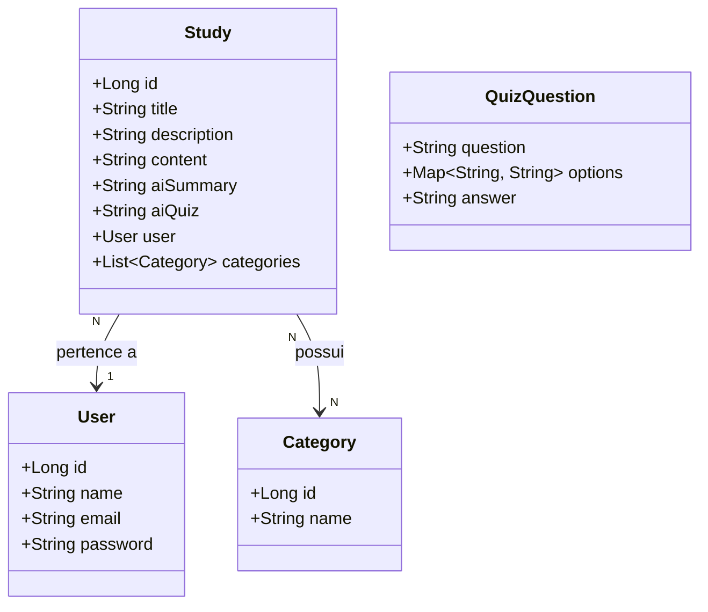

# 📚 EduNotes

EduNotes é uma aplicação backend para gerenciamento de estudos com suporte a **inteligência artificial**, permitindo que usuários criem anotações de estudo e gerem automaticamente **resumos** e **quizzes** com o auxílio da IA Mistral.

---

## ✨ Funcionalidades

- 📝 **Gestão de Estudos** — crie, edite e organize seus materiais de estudo com título, descrição e conteúdo
- 🤖 **Resumo com IA** — geração automática de resumos a partir do conteúdo inserido, utilizando Mistral AI
- 🧠 **Quiz com IA** — geração de quizzes interativos baseados no conteúdo do estudo
- 🗂️ **Categorias** — organize seus estudos por categorias personalizadas
- 👤 **Usuários** — cadastro e autenticação de usuários com login seguro

---

## 🛠️ Tecnologias

| Tecnologia | Descrição |
|---|---|
| Java 21 | Linguagem principal |
| Spring Boot | Framework web e de injeção de dependências |
| H2 Database | Banco de dados em memória para desenvolvimento |
| Mistral AI | Geração de resumos e quizzes com IA |
| Jakarta Persistence (JPA) | Mapeamento objeto-relacional |
| Lombok | Redução de boilerplate |

---

## 🗂️ Diagrama de Classes



---

## 🚀 Como executar

### Pré-requisitos

- Java 21+
- Maven 3.8+

### Passos

A aplicação estará disponível em `http://localhost:8080`.

O console do H2 pode ser acessado em `http://localhost:8080/h2-console`.

---

## 📁 Estrutura do Projeto

```
src/
└── main/
    └── java/
        └── com/univillePOO/eduNotes/
            ├── entity/        # Entidades JPA
            ├── repository/    # Repositórios Spring Data
            ├── service/       # Regras de negócio e integração com IA
            └── controller/    # Endpoints REST
```

---
